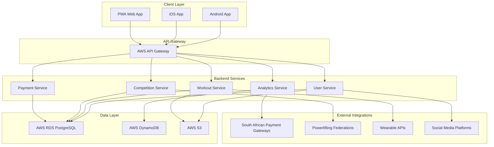
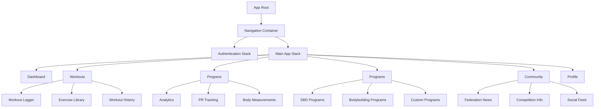
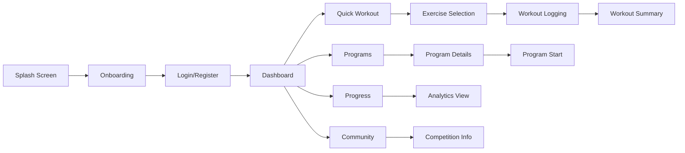
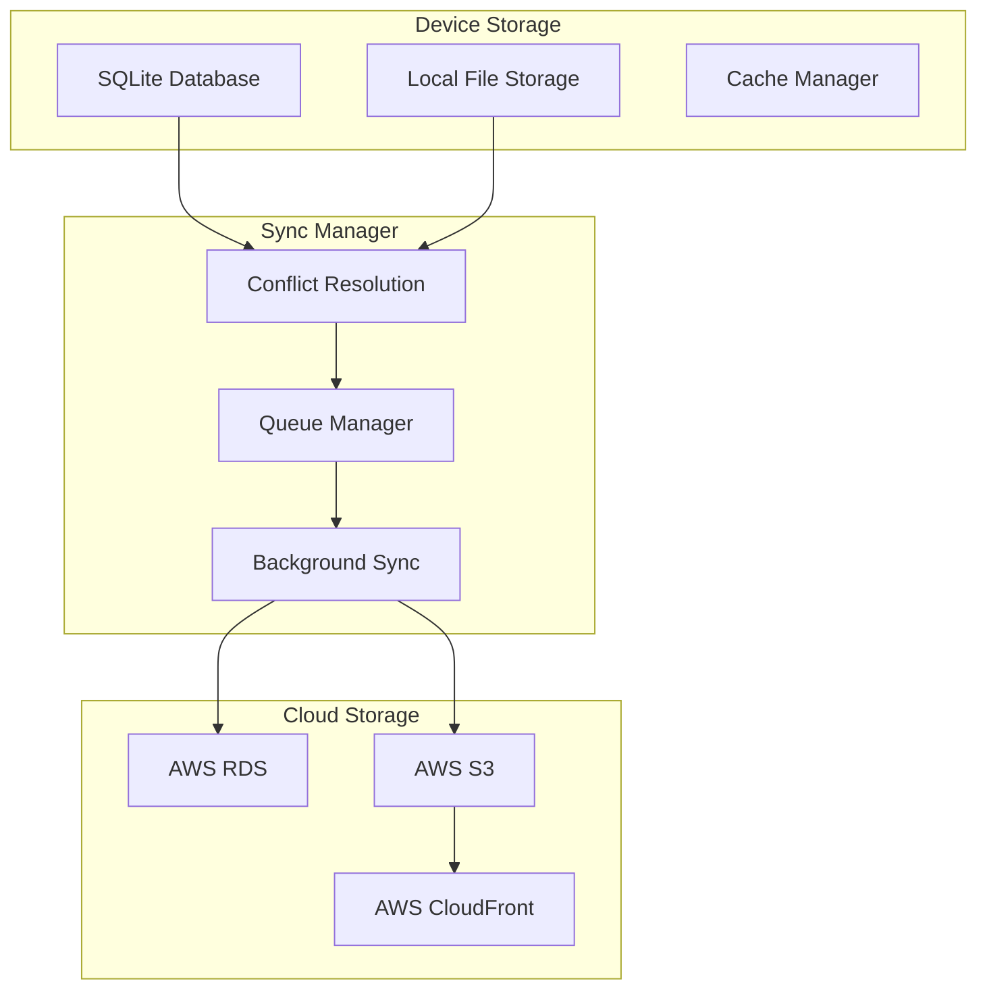
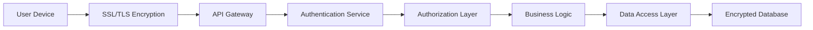
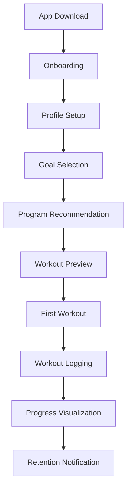
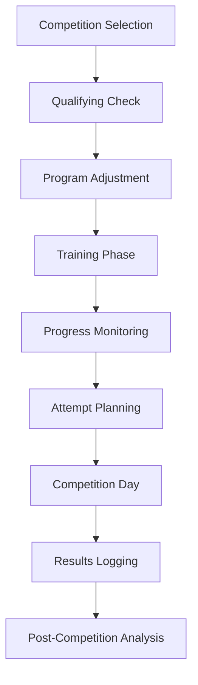

# South African Powerlifting App - Architecture Design Document

## Table of Contents
1. [Executive Summary](#executive-summary)
2. [South African Powerlifting Landscape Research](#south-african-powerlifting-landscape-research)
3. [App Architecture](#app-architecture)
4. [Core Feature Set](#core-feature-set)
5. [User Experience Design](#user-experience-design)
6. [Technical Architecture](#technical-architecture)
7. [Monetization Strategy](#monetization-strategy)
8. [Launch Strategy](#launch-strategy)
9. [Implementation Roadmap](#implementation-roadmap)

## Executive Summary

This document outlines the architecture and feature set for a mobile powerlifting app specifically designed for the South African market. The app, tentatively named "SBD SA" (Squat, Bench, Deadlift South Africa), will focus on powerlifting's core movements while incorporating bodybuilding features for serious lifters.

Key differentiators:
- Offline-first functionality addressing South Africa's high data costs
- Integration with South African powerlifting federations
- Metric system (kg) as default
- Android-first development approach (75-80% market share)
- POPIA-compliant data handling
- Localized payment options and pricing

## South African Powerlifting Landscape Research

### Powerlifting Federations in South Africa

1. **Powerlifting South Africa (PSA)**
   - Officially recognized by World Powerlifting Congress (WPC)
   - Hosts national championships and qualifying events
   - Uses kg measurements and standard powerlifting rules

2. **South African Powerlifting Federation (SAPF)**
   - Affiliated with International Powerlifting Federation (IPF)
   - Drug-tested federation with strict anti-doping policies
   - Hosts provincial and national competitions

3. **Classic Raw Powerlifting South Africa (CRPSA)**
   - Focuses on raw lifting (no supportive equipment)
   - Growing popularity among younger lifters
   - Less strict competition requirements

### Competition Structure

- **Provincial Championships**: Qualifying events for national competitions
- **National Championships**: Annual premier events
- **Divisional Structure**: Age groups (Junior, Open, Masters) and weight classes
- **Qualifying Standards**: Minimum lifts required for national-level competition

### Market Insights

- **Gym Culture**: Strong community aspect with gym-based powerlifting clubs
- **Competition Frequency**: 4-6 major national events per year
- **Equipment Availability**: Mix of commercial and specialized powerlifting gyms
- **Coaching Landscape**: Combination of formal coaching and peer-to-peer learning
- **Demographics**: Primarily male-dominated (70-75%) with growing female participation

## App Architecture

### High-Level System Architecture



### Frontend Architecture

#### Component Structure



#### Screen Navigation Flow



### Backend Architecture

#### Microservices Design

1. **User Service**
   - Authentication and authorization
   - Profile management
   - Preferences and settings
   - POPIA compliance handling

2. **Workout Service**
   - Workout logging and storage
   - Exercise library management
   - Program creation and tracking
   - Performance analytics

3. **Analytics Service**
   - Progress calculations
   - 1RM estimation algorithms
   - Trend analysis
   - Performance insights

4. **Competition Service**
   - Federation integration
   - Competition calendar
   - Qualifying standards tracking
   - Registration management

5. **Payment Service**
   - Subscription management
   - Local payment gateway integration
   - Invoice generation
   - Refund processing

### Offline-First Data Synchronization Strategy

#### Data Architecture



#### Sync Strategy

1. **Critical Data**: Immediate sync when connection available
   - Workout logs
   - User profile changes
   - Subscription status

2. **Important Data**: Batch sync within 1 hour
   - Progress updates
   - Program modifications
   - Social interactions

3. **Nice-to-have Data**: Sync when on WiFi only
   - Exercise videos
   - Educational content
   - Community feeds

### Security Architecture (POPIA Compliance)

#### Data Protection Measures

1. **Data Minimization**: Collect only essential user data
2. **Encryption**: End-to-end encryption for sensitive data
3. **Access Control**: Role-based access to user data
4. **Audit Logging**: Complete audit trail of data access
5. **Data Residency**: Store South African user data within South Africa
6. **User Rights**: Easy data export, modification, and deletion

#### Security Implementation



## Core Feature Set

### MVP Features (Phase 1)

1. **User Authentication & Profiles**
   - Email/social login
   - Basic profile setup
   - Units preference (kg default)
   - Privacy settings

2. **Workout Logging**
   - SBD exercise tracking
   - Basic bodybuilding exercises
   - Set/rep/weight logging
   - Rest timer
   - Workout history

3. **Progress Tracking**
   - 1RM calculator
   - Basic progress graphs
   - Personal records tracking
   - Body weight tracking

4. **Basic Programs**
   - 3 pre-built SBD programs
   - 2 bodybuilding programs
   - Program scheduling
   - Basic customization

5. **Offline Functionality**
   - Full workout logging offline
   - Program access offline
   - Sync when online

### Secondary Features (Phase 2)

1. **Advanced Analytics**
   - Volume tracking
   - Progress velocity
   - Strength curves
   - Comparative analysis

2. **Community Features**
   - User profiles
   - Workout sharing
   - Basic social feed
   - Achievement badges

3. **Competition Integration**
   - South African federation competition calendar
   - Qualifying standards tracking
   - Competition preparation tools

4. **Advanced Programs**
   - Custom program builder
   - AI-powered recommendations
   - Periodization templates
   - Deload management

### Powerlifting-Specific Features

1. **SBD Tracking**
   - Detailed exercise variations
   - Percentage-based training
   - RPE/RIR tracking
   - Bar loading calculator

2. **1RM Calculation**
   - Multiple algorithms (Epley, Brzycki, etc.)
   - Historical 1RM tracking
   - Projected strength gains
   - Competition readiness assessment

3. **Programming**
   - Block periodization
   - Weekly undulation
   - Competition peaking
   - Weak point identification

4. **Competition Features**
   - Meet preparation timeline
   - Attempt selection calculator
   - Weight class management
   - Rules and regulations reference

### Bodybuilding Features

1. **Hypertrophy Tracking**
   - Volume load tracking
   - Muscle group focus
   - Exercise variation tracking
   - Aesthetic progress photos

2. **Accessory Work**
   - Muscle imbalance correction
   - Injury prevention exercises
   - Mobility work
   - Recovery tracking

### South African Market-Specific Features

1. **Federation Integration**
   - PSA membership verification
   - SAPF qualifying standards
   - Local competition registration
   - South African records database

2. **Localization**
   - South African English terminology
   - Local gym directory
   - Coach directory
   - Equipment availability guidance

3. **Community Features**
   - South African lifting community
   - Local meet-ups
   - Gym communities
   - Provincial leaderboards

## User Experience Design

### User Personas

#### Primary Persona: "Serious Sipho" - Competitive Powerlifter
- **Age**: 28
- **Location**: Johannesburg
- **Experience**: 4 years of powerlifting
- **Goals**: Qualify for national championships, increase total
- **Pain Points**: Tracking progress across multiple platforms, lack of local competition info
- **Needs**: Advanced programming, competition preparation, performance analytics

#### Secondary Persona: "Bodybuilding Busi" - Hybrid Athlete
- **Age**: 24
- **Location**: Cape Town
- **Experience**: 2 years of training
- **Goals**: Build strength while maintaining aesthetics
- **Pain Points**: Balancing strength and hypertrophy training, limited data for offline use
- **Needs**: Flexible programming, body composition tracking, community support

#### Tertiary Persona: "Novice Neo" - Beginner Lifter
- **Age**: 19
- **Location**: Pretoria
- **Experience**: 6 months of training
- **Goals**: Learn proper form, build foundation strength
- **Pain Points**: Information overload, lack of guidance, intimidation at gym
- **Needs**: Exercise tutorials, structured programs, progress tracking

### User Journey Maps

#### Journey 1: First-Time User to First Workout



#### Journey 2: Competition Preparation



### Information Architecture

```
SBD SA App
├── Home
│   ├── Dashboard
│   ├── Quick Actions
│   └── Recent Activity
├── Workouts
│   ├── Start Workout
│   ├── Exercise Library
│   ├── Workout History
│   └── Programs
│       ├── SBD Programs
│       ├── Bodybuilding Programs
│       └── Custom Programs
├── Progress
│   ├── Analytics
│   ├── Personal Records
│   ├── Body Measurements
│   └── Photos
├── Community
│   ├── Feed
│   ├── Leaderboards
│   ├── Events
│   └── Federations
├── Profile
│   ├── Personal Info
│   ├── Settings
│   ├── Subscription
│   └── Achievements
```

### UI/UX Considerations for Serious Lifters

1. **Efficiency**: Minimize taps and swipes during workouts
2. **Clarity**: Large, readable fonts and high contrast
3. **Grip-Friendly**: Large touch targets for sweaty hands
4. **Minimal Distraction**: Clean interface during workout logging
5. **Data Visualization**: Clear, interpretable progress charts
6. **Customization**: Adaptable to different training styles
7. **Offline Priority**: Clear indication of offline/online status

### Accessibility Considerations

1. **Visual Impairments**
   - High contrast themes
   - Screen reader compatibility
   - Adjustable text sizes
   - Color-blind friendly design

2. **Motor Impairments**
   - Large touch targets
   - Voice commands for workout logging
   - One-handed operation support
   - Gesture customization

3. **Cognitive Considerations**
   - Clear information hierarchy
   - Progressive disclosure of features
   - Consistent navigation patterns
   - Error prevention and recovery

## Technical Architecture

### Recommended Technology Stack

#### Frontend

1. **Framework**: React Native
   - Cross-platform development
   - Strong community support
   - Offline capabilities
   - Performance optimization

2. **State Management**: Redux Toolkit
   - Predictable state updates
   - Time-travel debugging
   - Middleware support
   - Performance optimization

3. **Navigation**: React Navigation 6
   - Native-like navigation
   - Deep linking support
   - Tab-based navigation
   - Gesture handling

4. **Local Storage**: SQLite with WatermelonDB
   - Offline-first database
   - Reactive queries
   - Sync capabilities
   - Performance optimization

5. **UI Components**: NativeBase or React Native Paper
   - Consistent design system
   - Component library
   - Theme customization
   - Accessibility support

#### Backend

1. **Runtime**: Node.js with TypeScript
   - Type safety
   - Performance
   - Ecosystem support
   - Development experience

2. **Framework**: Express.js or NestJS
   - RESTful API development
   - Middleware support
   - Scalability
   - Documentation generation

3. **Database**: PostgreSQL (primary) with DynamoDB (analytics)
   - Relational data integrity
   - Complex queries
   - Analytics optimization
   - Performance at scale

4. **Authentication**: AWS Cognito
   - Secure user management
   - Social login integration
   - MFA support
   - POPIA compliance

5. **File Storage**: AWS S3 with CloudFront CDN
   - Scalable storage
   - Fast content delivery
   - Cost optimization
   - Global availability

#### Infrastructure

1. **Cloud Provider**: AWS
   - Reliable infrastructure
   - South African region (af-south-1)
   - Compliance certifications
   - Cost management

2. **API Gateway**: AWS API Gateway
   - Request routing
   - Rate limiting
   - Authentication
   - Monitoring

3. **Serverless**: AWS Lambda
   - Scalability
   - Cost efficiency
   - Maintenance
   - Performance

4. **Monitoring**: AWS CloudWatch with X-Ray
   - Performance monitoring
   - Error tracking
   - Resource optimization
   - User experience insights

### Database Schema Design

#### Core Tables

```sql
-- Users Table
CREATE TABLE users (
    id UUID PRIMARY KEY,
    email VARCHAR(255) UNIQUE NOT NULL,
    first_name VARCHAR(100) NOT NULL,
    last_name VARCHAR(100) NOT NULL,
    date_of_birth DATE,
    gender VARCHAR(20),
    preferred_units VARCHAR(10) DEFAULT 'kg',
    created_at TIMESTAMP DEFAULT CURRENT_TIMESTAMP,
    updated_at TIMESTAMP DEFAULT CURRENT_TIMESTAMP
);

-- Profiles Table
CREATE TABLE profiles (
    id UUID PRIMARY KEY REFERENCES users(id),
    avatar_url VARCHAR(500),
    bio TEXT,
    location VARCHAR(100),
    gym VARCHAR(100),
    federation_membership JSONB,
    social_links JSONB,
    privacy_settings JSONB,
    created_at TIMESTAMP DEFAULT CURRENT_TIMESTAMP,
    updated_at TIMESTAMP DEFAULT CURRENT_TIMESTAMP
);

-- Exercises Table
CREATE TABLE exercises (
    id UUID PRIMARY KEY,
    name VARCHAR(100) NOT NULL,
    category VARCHAR(50) NOT NULL,
    muscle_groups VARCHAR(100)[],
    equipment VARCHAR(50)[],
    instructions TEXT,
    video_url VARCHAR(500),
    created_at TIMESTAMP DEFAULT CURRENT_TIMESTAMP
);

-- Workouts Table
CREATE TABLE workouts (
    id UUID PRIMARY KEY,
    user_id UUID REFERENCES users(id),
    name VARCHAR(100),
    date DATE NOT NULL,
    duration_minutes INTEGER,
    notes TEXT,
    created_at TIMESTAMP DEFAULT CURRENT_TIMESTAMP
);

-- Workout Exercises Table
CREATE TABLE workout_exercises (
    id UUID PRIMARY KEY,
    workout_id UUID REFERENCES workouts(id),
    exercise_id UUID REFERENCES exercises(id),
    order_index INTEGER NOT NULL,
    notes TEXT,
    created_at TIMESTAMP DEFAULT CURRENT_TIMESTAMP
);

-- Sets Table
CREATE TABLE sets (
    id UUID PRIMARY KEY,
    workout_exercise_id UUID REFERENCES workout_exercises(id),
    set_number INTEGER NOT NULL,
    weight_kg DECIMAL(5,2),
    reps INTEGER,
    rpe INTEGER,
    distance_meters DECIMAL(8,2),
    duration_seconds INTEGER,
    rest_seconds INTEGER,
    created_at TIMESTAMP DEFAULT CURRENT_TIMESTAMP
);

-- Personal Records Table
CREATE TABLE personal_records (
    id UUID PRIMARY KEY,
    user_id UUID REFERENCES users(id),
    exercise_id UUID REFERENCES exercises(id),
    record_type VARCHAR(20) NOT NULL,
    value DECIMAL(10,2) NOT NULL,
    unit VARCHAR(10) NOT NULL,
    date DATE NOT NULL,
    workout_id UUID REFERENCES workouts(id),
    verified BOOLEAN DEFAULT FALSE,
    created_at TIMESTAMP DEFAULT CURRENT_TIMESTAMP
);

-- Programs Table
CREATE TABLE programs (
    id UUID PRIMARY KEY,
    name VARCHAR(100) NOT NULL,
    description TEXT,
    author_id UUID REFERENCES users(id),
    category VARCHAR(50) NOT NULL,
    difficulty_level INTEGER,
    duration_weeks INTEGER,
    public BOOLEAN DEFAULT FALSE,
    south_african_specific BOOLEAN DEFAULT FALSE,
    created_at TIMESTAMP DEFAULT CURRENT_TIMESTAMP,
    updated_at TIMESTAMP DEFAULT CURRENT_TIMESTAMP
);

-- Program Workouts Table
CREATE TABLE program_workouts (
    id UUID PRIMARY KEY,
    program_id UUID REFERENCES programs(id),
    day_number INTEGER NOT NULL,
    workout_template JSONB NOT NULL,
    notes TEXT,
    created_at TIMESTAMP DEFAULT CURRENT_TIMESTAMP
);

-- User Programs Table
CREATE TABLE user_programs (
    id UUID PRIMARY KEY,
    user_id UUID REFERENCES users(id),
    program_id UUID REFERENCES programs(id),
    start_date DATE NOT NULL,
    end_date DATE,
    current_week INTEGER DEFAULT 1,
    completed BOOLEAN DEFAULT FALSE,
    created_at TIMESTAMP DEFAULT CURRENT_TIMESTAMP,
    updated_at TIMESTAMP DEFAULT CURRENT_TIMESTAMP
);
```

### API Design Principles

1. **RESTful Architecture**
   - Resource-oriented endpoints
   - HTTP verb compliance
   - Consistent response formats
   - Proper status codes

2. **Authentication & Authorization**
   - JWT-based authentication
   - Role-based access control
   - API rate limiting
   - Request signing

3. **Data Formats**
   - JSON for request/response
   - Consistent error handling
   - Pagination for large datasets
   - Field selection support

4. **Performance Optimization**
   - Response caching
   - Compression
   - Minimal data transfer
   - Batch operations

#### Sample API Endpoints

```
# Authentication
POST /api/auth/login
POST /api/auth/register
POST /api/auth/refresh
DELETE /api/auth/logout

# User Management
GET /api/users/profile
PUT /api/users/profile
GET /api/users/preferences
PUT /api/users/preferences

# Workouts
GET /api/workouts
POST /api/workouts
GET /api/workouts/:id
PUT /api/workouts/:id
DELETE /api/workouts/:id

# Exercises
GET /api/exercises
GET /api/exercises/:id
GET /api/exercises/categories

# Programs
GET /api/programs
GET /api/programs/:id
POST /api/user-programs
GET /api/user-programs/:id
PUT /api/user-programs/:id

# Progress
GET /api/progress/personal-records
GET /api/progress/analytics
GET /api/progress/one-rep-max

# South African Features
GET /api/competitions
GET /api/federations
GET /api/qualifying-standards
```

### Integration Points

1. **Wearable Devices**
   - Garmin Connect API
   - Fitbit Web API
   - Apple HealthKit
   - Google Fit

2. **Payment Gateways**
   - PayFast (South Africa)
   - Yoco (South Africa)
   - Stripe (International)
   - PayPal (International)

3. **Social Media**
   - Facebook SDK
   - Instagram Basic Display API
   - Twitter API
   - WhatsApp Business API

4. **Federation APIs**
   - Powerlifting South Africa
   - South African Powerlifting Federation
   - International Powerlifting Federation

### Performance Optimization Strategies

1. **Frontend Optimization**
   - Code splitting
   - Lazy loading
   - Image optimization
   - Caching strategies

2. **Backend Optimization**
   - Database indexing
   - Query optimization
   - Response caching
   - Connection pooling

3. **Network Optimization**
   - Data compression
   - Request batching
   - Offline-first design
   - Sync optimization

4. **Mobile-Specific Optimization**
   - Battery usage optimization
   - Memory management
   - Background processing
   - Thermal throttling

## Monetization Strategy

### Freemium Model Details

#### Free Tier Features

1. **Basic Workout Logging**
   - Up to 3 workouts per week
   - Basic exercise library (50 exercises)
   - Simple progress tracking
   - Manual data entry only

2. **Limited Program Access**
   - 2 basic programs
   - No customization
   - Basic analytics

3. **Community Features**
   - View public content
   - Basic profile
   - Limited social interaction

4. **Offline Functionality**
   - Basic offline logging
   - Manual sync only

#### Premium Tier Features (R99-R149/month)

1. **Advanced Workout Features**
   - Unlimited workouts
   - Full exercise library (200+ exercises)
   - Advanced analytics
   - Video exercise demonstrations
   - Wearable integration

2. **Premium Programs**
   - Full program library
   - Custom program builder
   - AI-powered recommendations
   - Periodization templates

3. **Advanced Analytics**
   - Detailed progress analysis
   - Strength projections
   - Weak point identification
   - Comparative analysis

4. **South African Features**
   - Competition integration
   - Federation membership verification
   - Qualifying standards tracking
   - Local competition calendar

5. **Enhanced Community**
   - Full social features
   - Group challenges
   - Coach connections
   - Advanced messaging

6. **Premium Support**
   - Priority customer support
   - Data export/import
   - Advanced customization
   - Early access to features

### Premium Feature Breakdown

#### Powerlifting Focus (R99/month)

1. **SBD Specialization**
   - Advanced SBD tracking
   - Competition preparation tools
   - Attempt selection calculator
   - Peaking programs

2. **Performance Analytics**
   - 1RM projection algorithms
   - Velocity-based training
   - Powerlifting-specific metrics
   - Competition simulation

#### Bodybuilding Focus (R99/month)

1. **Hypertrophy Tools**
   - Volume tracking
   - Muscle group focus
   - Aesthetic progress photos
   - Body composition tracking

2. **Accessory Work**
   - Muscle imbalance correction
   - Injury prevention
   - Mobility programs
   - Recovery optimization

#### All-Access Premium (R149/month)

1. **Complete Feature Set**
   - All powerlifting features
   - All bodybuilding features
   - Advanced coaching tools
   - Custom program marketplace

2. **Exclusive Content**
   - Pro athlete programs
   - Educational content
   - Live coaching sessions
   - Competition webinars

### South African Pricing Strategy

1. **Market Positioning**
   - Mid-range pricing (R99-R149/month)
   - Annual subscription discount (R999/year)
   - Student discounts (50% off)
   - Family plans (R199/month for 4 users)

2. **Payment Options**
   - Credit/Debit cards
   - EFT transfers
   - Mobile money (VodaPay, MTN Mobile Money)
   - Retail vouchers (Shoprite, Pick n Pay)

3. **Promotional Strategy**
   - 14-day free trial
   - First-month discount (50%)
   - Referral program (1 month free)
   - Seasonal promotions

### Local Payment Integration

1. **PayFast Integration**
   - South African payment gateway
   - Credit card processing
   - EFT payments
   - Zapper QR code payments

2. **Yoco Integration**
   - Mobile card payments
   - In-person payment options
   - Gym partnership opportunities
   - Local currency support

3. **Mobile Money**
   - VodaPay integration
   - MTN Mobile Money
   - Standard Bank Mobile Money
   - FNB eWallet

## Launch Strategy

### MVP Feature Prioritization

#### Priority 1 (Must-Have)
1. User authentication
2. Basic workout logging
3. SBD exercise tracking
4. 1RM calculation
5. Offline functionality
6. Progress visualization
7. Android app (stable)

#### Priority 2 (Should-Have)
1. Basic programs
2. iOS app
3. Community features
4. South African competition calendar
5. Payment integration

#### Priority 3 (Nice-to-Have)
1. Advanced analytics
2. Wearable integration
3. Custom program builder
4. Social features
5. Video content

### Phased Rollout Plan

#### Phase 1: MVP Launch (Months 1-3)
1. **Android App Release**
   - Core functionality only
   - Basic UI/UX
   - Essential features
   - Bug fixes and stability

2. **Initial User Acquisition**
   - Powerlifting gyms in major cities
   - Social media targeting
   - Influencer partnerships
   - Beta testing group

#### Phase 2: Feature Expansion (Months 4-6)
1. **iOS App Release**
   - Feature parity with Android
   - iOS-specific optimizations
   - App Store optimization

2. **Premium Features Launch**
   - Subscription system
   - Advanced features
   - Payment integration
   - Customer support

#### Phase 3: Market Expansion (Months 7-12)
1. **Community Features**
   - Social functionality
   - User-generated content
   - Community challenges
   - Leaderboards

2. **Partnership Integration**
   - Gym partnerships
   - Federation integration
   - Coach marketplace
   - Equipment partnerships

### User Acquisition Strategy for South African Market

1. **Digital Marketing**
   - Facebook/Instagram targeting (powerlifting interests)
   - YouTube content (exercise tutorials, South African lifters)
   - Google Ads (powerlifting keywords)
   - TikTok challenges (#SBDSouthAfrica)

2. **Community Engagement**
   - Sponsor local powerlifting competitions
   - Gym partnerships (V virgin Active, Planet Fitness)
   - University powerlifting clubs
   - Online communities (Reddit, Facebook groups)

3. **Influencer Partnerships**
   - South African powerlifting athletes
   - Fitness influencers with powerlifting focus
   - Gym owners and coaches
   - Physical therapists and sports doctors

4. **Content Marketing**
   - South African powerlifting news
   - Competition coverage
   - Training tips for local conditions
   - Nutrition advice for South African market

### Partnership Opportunities

1. **Gym Partnerships**
   - Virgin Active South Africa
   - Planet Fitness South Africa
   - Specialized powerlifting gyms
   - University gyms

2. **Federation Partnerships**
   - Powerlifting South Africa (PSA)
   - South African Powerlifting Federation (SAPF)
   - Provincial powerlifting associations
   - IPF South Africa

3. **Equipment Partnerships**
   - Local gym equipment suppliers
   - Supplement companies (USN, Biogen)
   - Sportswear brands
   - Fitness technology companies

4. **Healthcare Partnerships**
   - Sports medicine practices
   - Physical therapy clinics
   - Nutritionists
   - Sports psychologists

## Implementation Roadmap

### 3-Month MVP Development Plan

#### Month 1: Foundation
- **Week 1-2**: Project setup and architecture
  - Development environment configuration
  - Database design and setup
  - API framework setup
  - CI/CD pipeline

- **Week 3-4**: Core authentication
  - User registration/login
  - Profile management
  - Security implementation
  - Basic UI components

#### Month 2: Core Features
- **Week 5-6**: Workout logging
  - Exercise library
  - Workout creation
  - Set tracking
  - Offline functionality

- **Week 7-8**: Progress tracking
  - 1RM calculation
  - Basic analytics
  - Progress visualization
  - Personal records

#### Month 3: Polish and Launch
- **Week 9-10**: Program features
  - Basic programs
  - Program scheduling
  - Workout templates
  - UI/UX refinement

- **Week 11-12**: Testing and launch
  - Comprehensive testing
  - Bug fixes
  - Performance optimization
  - App store submission

### 6-Month Growth Plan

#### Month 4-6: Feature Expansion
- iOS app development
- Premium features implementation
- Community features
- Advanced analytics
- Partnership integrations

### 12-Month Scale Plan

#### Month 7-12: Market Leadership
- Advanced social features
- AI-powered recommendations
- Video content platform
- Coach marketplace
- International expansion preparation

### Success Metrics

#### Technical Metrics
- App stability (99.9% uptime)
- Load time (<3 seconds)
- Offline functionality (100% core features)
- Sync reliability (>95% success rate)

#### User Metrics
- Monthly active users (10,000 by month 6)
- User retention (60% monthly, 30% quarterly)
- Conversion rate (15% free to premium)
- User satisfaction (4.5+ star rating)

#### Business Metrics
- Revenue (R500,000 by month 12)
- Customer acquisition cost (<R200)
- Lifetime value (>R2,000)
- Market share (25% of South African powerlifting app market)

## Conclusion

The South African powerlifting app architecture presented here addresses the specific needs of the local market while incorporating global best practices in mobile app development. The offline-first approach, POPIA compliance, and Android-first strategy align with the unique challenges and opportunities of the South African market.

The phased implementation plan allows for rapid market entry with an MVP, followed by strategic feature expansion based on user feedback and market demands. The monetization strategy balances accessibility with premium value, while the partnership approach creates a sustainable ecosystem around the app.

By focusing on the specific needs of South African powerlifters and bodybuilders, this app has the potential to become the leading platform for strength athletes in the region, with future opportunities for expansion into other African markets.