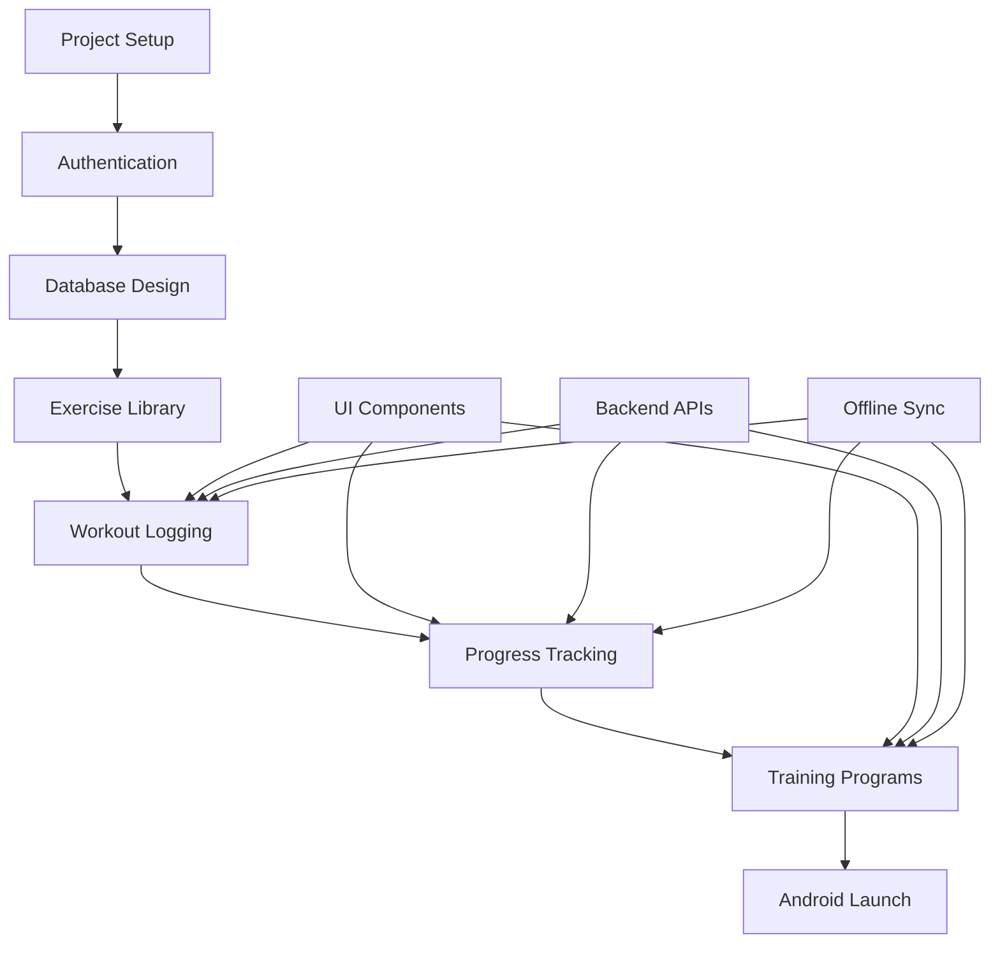
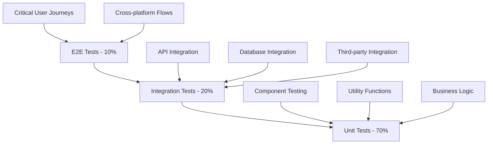
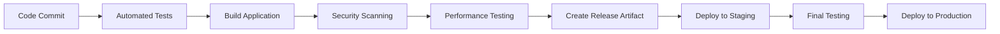
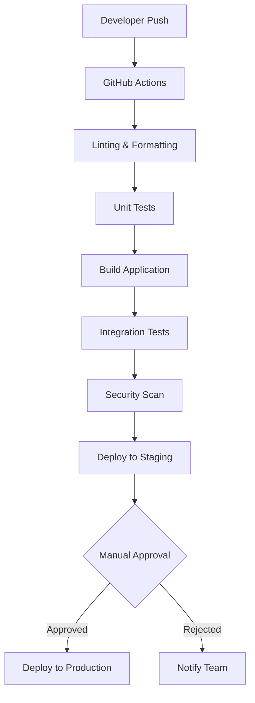
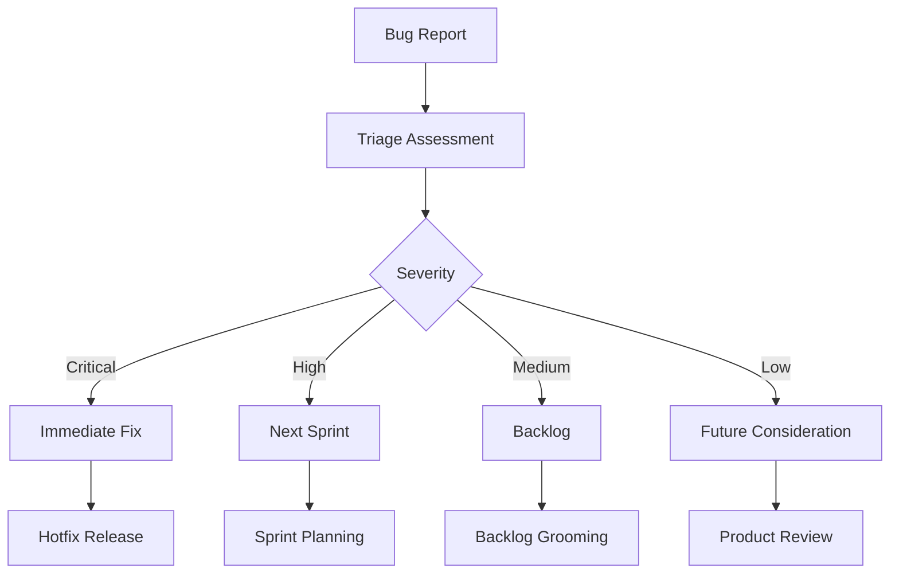

# South African Powerlifting App - Development Plan

## Table of Contents
1. [Executive Summary](#executive-summary)
2. [Technology Stack Finalization](#technology-stack-finalization)
3. [Project Structure](#project-structure)
4. [Development Roadmap](#development-roadmap)
5. [Team Structure and Roles](#team-structure-and-roles)
6. [Implementation Phases](#implementation-phases)
7. [Quality Assurance Plan](#quality-assurance-plan)
8. [Deployment Strategy](#deployment-strategy)
9. [Post-Launch Support](#post-launch-support)

## Executive Summary

This development plan translates the architectural decisions from the SBD SA Architecture Design Document into actionable implementation steps. The plan focuses on delivering a high-quality, offline-first powerlifting app for the South African market within a 6-8 month timeline, with an MVP ready for launch in the first 3 months.

Key implementation priorities:
- Android-first development approach (75-80% South African market share)
- Offline-first functionality to address high data costs
- POPIA-compliant data handling
- Freemium monetization model with South African pricing (R99-R149/month)
- Integration with South African powerlifting federations and payment gateways

## Technology Stack Finalization

### Frontend Technology Stack

#### Mobile Application Framework
- **React Native**: Version 0.72.x (latest stable)
  - Cross-platform development for Android and iOS
  - Strong community support and ecosystem
  - Offline capabilities and performance optimization
  - Native module support for platform-specific features

#### State Management
- **Redux Toolkit**: Version 1.9.x
  - Predictable state management with Redux
  - Built-in middleware for async operations (RTK Query)
  - Time-travel debugging capabilities
  - Performance optimizations with Immer

#### Navigation
- **React Navigation 6**: Version 6.x
  - Native-like navigation experience
  - Deep linking support for marketing campaigns
  - Tab-based navigation for primary app sections
  - Gesture handling for workout flows

#### Local Storage & Database
- **SQLite**: Version 3.40.x
- **WatermelonDB**: Version 0.27.x
  - Offline-first reactive database
  - Sync capabilities with backend
  - Query optimization
  - Performance for large datasets

#### UI Components & Styling
- **React Native Paper**: Version 5.8.x
  - Material Design components
  - Theme customization for South African branding
  - Accessibility support
  - Consistent design system

#### Additional Libraries
- **React Native Reanimated**: Version 3.3.x for animations
- **React Native Gesture Handler**: Version 2.9.x for gestures
- **React Native Async Storage**: Version 1.19.x for simple key-value storage
- **React Native Vector Icons**: Version 10.0.x for icons
- **React Native Video**: Version 5.2.x for exercise demonstrations

### Backend Technology Stack

#### Runtime & Framework
- **Node.js**: Version 18.x LTS
- **TypeScript**: Version 5.0.x
- **NestJS**: Version 10.x
  - TypeScript-first framework
  - Modular architecture for microservices
  - Built-in dependency injection
  - Extensive middleware support

#### Database Technologies
- **PostgreSQL**: Version 15.x
  - Primary relational database for structured data
  - Complex queries and transactions
  - JSONB support for flexible data structures
  - Full-text search capabilities

- **Amazon DynamoDB**: Version latest
  - NoSQL database for analytics and user behavior data
  - Scalable performance for large datasets
  - Time-series data for workout history

- **Redis**: Version 7.x
  - Caching layer for frequently accessed data
  - Session management
  - Queue management for background jobs

#### Authentication & Security
- **AWS Cognito**: For user authentication
  - Secure user management
  - Social login integration (Google, Facebook)
  - Multi-factor authentication support
  - POPIA compliance features

- **JWT**: Version 9.0.x for API authentication
- **bcrypt**: Version 5.1.x for password hashing
- **Helmet**: Version 7.0.x for security headers

#### API & Communication
- **RESTful API**: Design with OpenAPI 3.0 specification
- **GraphQL**: Version 16.6.x for flexible data queries (Phase 2)
- **Socket.io**: Version 4.6.x for real-time features (Phase 2)
- **AWS API Gateway**: For API management and scaling

### AWS Infrastructure Stack

#### Core Services
- **AWS Region**: af-south-1 (Cape Town) for data residency
- **AWS Lambda**: Serverless compute for microservices
- **AWS API Gateway**: API management and routing
- **AWS RDS**: Managed PostgreSQL database
- **AWS DynamoDB**: NoSQL database for analytics
- **AWS S3**: Object storage for files and media
- **AWS CloudFront**: CDN for content delivery

#### Additional AWS Services
- **AWS CloudWatch**: Monitoring and logging
- **AWS X-Ray**: Distributed tracing
- **AWS SQS**: Message queuing for async operations
- **AWS SES**: Email notifications
- **AWS SNS**: Push notifications
- **AWS Certificate Manager**: SSL certificate management
- **AWS WAF**: Web application firewall

### Third-Party Services & SDKs

#### Payment Gateways (South African Focus)
- **PayFast SDK**: For South African payment processing
  - Credit/Debit card payments
  - EFT transfers
  - Zapper QR code payments

- **Yoco SDK**: For mobile card payments
  - In-person payment options
  - Gym partnership opportunities

- **Stripe SDK**: Version 14.9.x (International backup)
  - Global payment processing
  - Subscription management

#### Analytics & Monitoring
- **Firebase Analytics**: For user behavior tracking
- **Sentry**: Version 7.46.x for error tracking
- **Datadog**: Version latest for application monitoring

#### Social Integration
- **Facebook SDK**: Version 16.x for social login and sharing
- **Instagram Basic Display API**: For content sharing
- **WhatsApp Business API**: For notifications (Phase 2)

### Development Tools & Environment Setup

#### Development Environment
- **Node Package Manager**: npm 9.x or yarn 1.22.x
- **React Native CLI**: Version 2.0.x
- **Android Studio**: Latest stable version with Android SDK 33
- **Xcode**: Version 14.x (for iOS development)
- **VS Code**: Primary IDE with recommended extensions

#### Code Quality & Testing Tools
- **ESLint**: Version 8.42.x for JavaScript/TypeScript linting
- **Prettier**: Version 2.8.x for code formatting
- **TypeScript**: Version 5.0.x for type checking
- **Jest**: Version 29.5.x for unit testing
- **React Native Testing Library**: Version 12.1.x for component testing
- **Detox**: Version 20.10.x for E2E testing
- **Husky**: Version 8.0.x for Git hooks
- **lint-staged**: Version 13.2.x for pre-commit checks

#### CI/CD Tools
- **GitHub Actions**: For continuous integration and deployment
- **Fastlane**: Version 2.214.x for automated app deployment
- **Docker**: Version 24.x for containerization
- **Terraform**: Version 1.4.x for infrastructure as code

## Project Structure

### Repository Organization

#### Monorepo Structure
```
sbdsa-app/
├── packages/
│   ├── mobile/                 # React Native app
│   │   ├── android/           # Android-specific code
│   │   ├── ios/               # iOS-specific code
│   │   ├── src/               # Cross-platform source code
│   │   │   ├── components/    # Reusable UI components
│   │   │   ├── screens/       # App screens
│   │   │   ├── navigation/    # Navigation configuration
│   │   │   ├── services/      # API and external service integration
│   │   │   ├── store/         # Redux store configuration
│   │   │   ├── utils/         # Utility functions
│   │   │   ├── hooks/         # Custom React hooks
│   │   │   ├── types/         # TypeScript type definitions
│   │   │   └── assets/        # Images, fonts, etc.
│   │   ├── __tests__/         # Test files
│   │   └── package.json
│   │
│   ├── backend/               # NestJS backend
│   │   ├── src/
│   │   │   ├── auth/          # Authentication module
│   │   │   ├── users/         # User management module
│   │   │   ├── workouts/      # Workout logging module
│   │   │   ├── programs/      # Training programs module
│   │   │   ├── analytics/     # Analytics module
│   │   │   ├── payments/      # Payment processing module
│   │   │   ├── competitions/  # Competition module
│   │   │   ├── common/        # Shared utilities
│   │   │   └── config/        # Configuration files
│   │   ├── test/              # Test files
│   │   └── package.json
│   │
│   └── shared/                # Shared code between frontend and backend
│       ├── types/             # Shared TypeScript types
│       ├── constants/         # Shared constants
│       ├── validation/        # Shared validation schemas
│       └── package.json
│
├── infrastructure/            # Infrastructure as code
│   ├── terraform/            # AWS infrastructure
│   ├── docker/               # Docker configurations
│   └── cicd/                 # CI/CD pipeline configurations
│
├── docs/                     # Documentation
│   ├── api/                  # API documentation
│   ├── deployment/           # Deployment guides
│   └── development/          # Development guides
│
├── scripts/                  # Build and deployment scripts
├── .github/                  # GitHub workflows
├── package.json              # Root package.json
└── README.md
```

### Code Organization Principles

#### Modular Architecture
- **Feature-based modules**: Group code by feature rather than type
- **Separation of concerns**: Clear boundaries between UI, business logic, and data
- **Dependency injection**: Use dependency injection for testability and modularity
- **Single responsibility**: Each module/class/function has a single responsibility

#### Component Design Principles
- **Reusable components**: Create a library of reusable UI components
- **Presentational vs. Container components**: Separate logic from presentation
- **Props-driven design**: Components should be driven by props rather than internal state
- **Composition over inheritance**: Favor composition patterns for code reuse

### Naming Conventions and Coding Standards

#### File Naming
- **Components**: PascalCase (e.g., `WorkoutLogger.tsx`)
- **Utilities**: camelCase (e.g., `formatWeight.ts`)
- **Constants**: UPPER_SNAKE_CASE (e.g., `API_ENDPOINTS.ts`)
- **Types**: PascalCase with descriptive suffixes (e.g., `WorkoutTypes.ts`)

#### Code Style
- **TypeScript**: Strict mode enabled for type safety
- **ESLint**: Airbnb style guide with customizations
- **Prettier**: Consistent code formatting
- **Import order**: External libraries, internal modules, relative imports
- **Naming**: Descriptive names that clearly indicate purpose

#### Git Commit Convention
- **Conventional Commits**: Standardized commit message format
  - `feat:` for new features
  - `fix:` for bug fixes
  - `docs:` for documentation changes
  - `style:` for code style changes
  - `refactor:` for code refactoring
  - `test:` for adding tests
  - `chore:` for maintenance tasks

### Branching Strategy for Version Control

#### Git Flow Model
```
main (production)
├── develop (integration)
│   ├── feature/user-authentication
│   ├── feature/workout-logging
│   └── feature/progress-tracking
│
├── release/v1.0.0
└── hotfix/critical-bug-fix
```

#### Branch Types
- **main**: Production-ready code, tagged with release versions
- **develop**: Integration branch for upcoming releases
- **feature/***: Feature development branches from develop
- **release/***: Release preparation branches from develop
- **hotfix/***: Critical bug fixes from main

#### Branch Protection Rules
- **main branch**: Require pull request reviews, pass CI/CD checks
- **develop branch**: Require pull request reviews, pass CI/CD checks
- **Required reviewers**: At least 2 team members for code review
- **Status checks**: All tests must pass, code coverage threshold met

## Development Roadmap

### Overall Timeline: 6-8 Months to Launch

#### Phase 1: Foundation & MVP Development (Months 1-3)
- Focus on core functionality for Android platform
- Implement essential features for powerlifting tracking
- Establish backend infrastructure and APIs
- Prepare for initial Android launch

#### Phase 2: Feature Expansion & iOS Development (Months 4-5)
- Develop iOS application with feature parity
- Implement premium features and monetization
- Add community and social features
- Integrate South African payment gateways

#### Phase 3: Polish, Testing & Launch Preparation (Month 6)
- Comprehensive testing and bug fixing
- Performance optimization
- App store submission and approval
- Launch marketing preparation

### Detailed Sprint Planning

#### Month 1: Foundation Setup (4 Sprints)

##### Sprint 1: Project Infrastructure (Weeks 1-2)
**Objectives:**
- Set up development environment and tools
- Establish project structure and repositories
- Configure CI/CD pipeline
- Set up AWS infrastructure foundation

**Deliverables:**
- Monorepo structure with separate packages
- Development environment documentation
- CI/CD pipeline with automated testing
- Basic AWS infrastructure (VPC, security groups, IAM roles)
- Code quality tools configuration (ESLint, Prettier, Husky)

**Acceptance Criteria:**
- All team members can run the project locally
- CI/CD pipeline runs successfully on commits
- Code quality checks enforce standards
- AWS environment is secure and scalable

##### Sprint 2: Authentication & User Management (Weeks 3-4)
**Objectives:**
- Implement user authentication system
- Create user profile management
- Set up security infrastructure
- Develop basic UI components

**Deliverables:**
- AWS Cognito integration
- User registration and login functionality
- Basic profile management
- Secure API endpoints
- Core UI component library
- Authentication flow screens

**Acceptance Criteria:**
- Users can register with email and social login
- User profiles can be created and updated
- Authentication tokens are securely managed
- UI components are consistent and accessible

#### Month 2: Core Features (4 Sprints)

##### Sprint 3: Workout Logging Foundation (Weeks 5-6)
**Objectives:**
- Implement exercise library
- Create workout logging functionality
- Develop data synchronization
- Build offline capabilities

**Deliverables:**
- Exercise library with SBD focus
- Workout creation and logging interface
- SQLite database with WatermelonDB
- Offline-first data synchronization
- Rest timer functionality

**Acceptance Criteria:**
- Users can create and log workouts
- Exercise library includes powerlifting movements
- Data syncs when connection is available
- App functions fully offline for core features

##### Sprint 4: Progress Tracking & Analytics (Weeks 7-8)
**Objectives:**
- Implement 1RM calculation algorithms
- Create progress visualization
- Develop personal records tracking
- Build analytics dashboard

**Deliverables:**
- 1RM calculation with multiple algorithms
- Progress charts and graphs
- Personal records tracking
- Basic analytics dashboard
- Body weight tracking

**Acceptance Criteria:**
- 1RM calculations are accurate and consistent
- Progress visualization is clear and informative
- Personal records are automatically detected
- Dashboard provides meaningful insights

#### Month 3: Program Features & Polish (4 Sprints)

##### Sprint 5: Training Programs (Weeks 9-10)
**Objectives:**
- Implement pre-built training programs
- Create program scheduling system
- Develop workout templates
- Add program customization

**Deliverables:**
- 3 pre-built SBD programs
- 2 bodybuilding programs
- Program scheduling and tracking
- Workout template system
- Basic program customization

**Acceptance Criteria:**
- Users can select and follow pre-built programs
- Program scheduling is intuitive and reliable
- Workout templates are easy to use
- Basic customization options are available

##### Sprint 6: UI/UX Polish & Android Optimization (Weeks 11-12)
**Objectives:**
- Refine user interface and experience
- Optimize for Android devices
- Improve app performance
- Prepare for launch

**Deliverables:**
- Polished UI/UX with South African branding
- Android-specific optimizations
- Performance improvements
- Accessibility enhancements
- Launch-ready Android app

**Acceptance Criteria:**
- App is intuitive and easy to navigate
- Performance meets benchmarks (fast loading, smooth animations)
- Accessibility features are implemented
- App is stable and ready for release

### Feature Dependencies and Sequencing

#### Critical Path Dependencies


#### Parallel Development Opportunities
- UI component development can run parallel to backend API development
- Exercise library content creation can happen independently
- Testing infrastructure can be set up while features are being developed
- Marketing materials can be prepared during development phases

#### Risk Assessment and Mitigation Strategies

##### Technical Risks
| Risk | Probability | Impact | Mitigation Strategy |
|------|-------------|--------|---------------------|
| React Native performance issues | Medium | High | Early performance testing, native modules for critical paths |
| Offline sync complexity | High | High | Incremental implementation, thorough testing of edge cases |
| AWS service limitations | Low | Medium | Backup plans for critical services, monitoring of usage |
| Third-party integration issues | Medium | Medium | Early integration testing, fallback implementations |

##### Project Risks
| Risk | Probability | Impact | Mitigation Strategy |
|------|-------------|--------|---------------------|
| Scope creep | High | High | Strict MVP definition, feature prioritization process |
| Team skill gaps | Medium | High | Training plan, hiring strategy, documentation |
| Timeline delays | Medium | High | Buffer time in schedule, regular progress reviews |
| App store rejection | Low | High | Early compliance review, testing on real devices |

##### Market Risks
| Risk | Probability | Impact | Mitigation Strategy |
|------|-------------|--------|---------------------|
| User adoption challenges | Medium | High | Beta testing program, user feedback incorporation |
| Competitive pressure | High | Medium | Differentiation through South African features |
| Payment gateway issues | Medium | Medium | Multiple payment options, thorough testing |
| POPIA compliance challenges | Low | High | Legal consultation, privacy-by-design approach |

## Team Structure and Roles

### Core Development Team

#### Product Manager (1 FTE)
**Responsibilities:**
- Product vision and strategy
- Feature prioritization and roadmap planning
- User story creation and backlog management
- Stakeholder communication
- Market research and competitive analysis

**Required Skills:**
- Product management experience
- Agile/Scrum methodologies
- User experience design understanding
- Market research and analysis
- Communication and leadership

#### Mobile Lead Developer (1 FTE)
**Responsibilities:**
- React Native application architecture
- Code review and quality standards
- Technical decision making
- Mentoring junior developers
- Performance optimization

**Required Skills:**
- React Native expertise (3+ years)
- Mobile app development experience
- TypeScript proficiency
- State management (Redux/Context)
- Offline-first application design

#### Mobile Developer (1-2 FTE)
**Responsibilities:**
- Feature implementation
- UI component development
- Unit and integration testing
- Bug fixing and optimization
- Code documentation

**Required Skills:**
- React Native experience (2+ years)
- JavaScript/TypeScript proficiency
- Mobile UI/UX understanding
- Testing frameworks (Jest, Detox)
- Git and version control

#### Backend Lead Developer (1 FTE)
**Responsibilities:**
- Backend system architecture
- API design and implementation
- Database design and optimization
- Security implementation
- Infrastructure management

**Required Skills:**
- Node.js/TypeScript expertise
- RESTful API design
- Database design (PostgreSQL, NoSQL)
- Cloud platform experience (AWS)
- Security best practices

#### Backend Developer (1 FTE)
**Responsibilities:**
- API endpoint implementation
- Business logic development
- Database queries and optimization
- Testing and debugging
- Monitoring and logging

**Required Skills:**
- Node.js/TypeScript experience
- Database development
- API development
- Testing methodologies
- Problem-solving skills

#### UI/UX Designer (0.5 FTE)
**Responsibilities:**
- User interface design
- User experience flow design
- Design system creation
- Usability testing
- Brand consistency

**Required Skills:**
- Mobile app design experience
- Design tools (Figma, Sketch)
- User research and testing
- Design systems
- Accessibility standards

#### QA Engineer (0.5-1 FTE)
**Responsibilities:**
- Test planning and execution
- Automated test development
- Bug tracking and verification
- Performance testing
- Device compatibility testing

**Required Skills:**
- Mobile testing experience
- Test automation frameworks
- Bug tracking systems
- Performance testing tools
- South African device knowledge

### Extended Team (Part-time/Contract)

#### DevOps Engineer (0.25 FTE)
**Responsibilities:**
- CI/CD pipeline maintenance
- Infrastructure management
- Monitoring and alerting
- Security implementation
- Deployment automation

**Required Skills:**
- AWS services
- CI/CD tools
- Infrastructure as code
- Security best practices
- Monitoring solutions

#### Powerlifting Domain Expert (0.25 FTE)
**Responsibilities:**
- Feature validation
- Content accuracy review
- User community insights
- Competition rules verification
- Training program validation

**Required Skills:**
- Powerlifting expertise
- South African federation knowledge
- Coaching experience
- Community connections
- Content creation

### Collaboration Workflows

#### Agile Development Process
- **Sprint Duration**: 2 weeks
- **Sprint Planning**: First Monday of each sprint
- **Daily Standups**: 15-minute daily meetings
- **Sprint Review**: Last Friday of each sprint
- **Retrospective**: Last Friday of each sprint after review

#### Communication Plan
- **Daily Communication**: Slack for quick questions and updates
- **Weekly Meetings**: Sprint planning, review, and retrospectives
- **Bi-weekly Meetings**: Product roadmap and stakeholder updates
- **Monthly Meetings**: Team performance and process improvement
- **Documentation**: Confluence for project documentation and decisions

#### Decision-Making Process
- **Technical Decisions**: Lead developers with team input
- **Product Decisions**: Product manager with stakeholder input
- **Process Decisions**: Team consensus with facilitation
- **Escalation Process**: Clear path for resolving blockers and conflicts

## Implementation Phases

### Phase 1: Foundation Setup and Core Infrastructure (Weeks 1-6)

#### Objectives
- Establish development environment and infrastructure
- Implement core authentication and user management
- Create foundation for offline-first functionality
- Build reusable UI component library

#### Key Deliverables
1. **Development Environment Setup** (Week 1)
   - Monorepo structure with separate packages
   - Development tools and configurations
   - CI/CD pipeline with automated testing
   - Code quality standards and enforcement

2. **Authentication System** (Weeks 2-3)
   - AWS Cognito integration
   - User registration and login flows
   - Social login integration
   - Security token management
   - Basic profile management

3. **Backend Infrastructure** (Weeks 3-4)
   - NestJS project setup and configuration
   - Database design and implementation
   - API gateway configuration
   - Basic microservices architecture
   - Security implementation

4. **UI Component Library** (Weeks 4-5)
   - Design system implementation
   - Core UI components
   - Theme and branding
   - Accessibility features
   - Component documentation

5. **Offline-First Foundation** (Weeks 5-6)
   - SQLite database setup
   - WatermelonDB configuration
   - Sync manager implementation
   - Conflict resolution strategy
   - Background sync capabilities

#### Success Criteria
- All team members can run the project locally
- CI/CD pipeline runs successfully on all commits
- Users can register, login, and manage profiles
- Basic infrastructure is secure and scalable
- Core UI components are consistent and accessible

### Phase 2: MVP Feature Implementation (Weeks 7-18)

#### Objectives
- Implement core workout logging functionality
- Create progress tracking and analytics
- Develop training programs system
- Build comprehensive exercise library

#### Key Deliverables

##### Sprint 7-8: Exercise Library & Workout Logging (Weeks 7-10)
1. **Exercise Library** (Weeks 7-8)
   - Powerlifting-focused exercise database
   - Exercise instructions and specifications
   - Exercise categories and muscle groups
   - Exercise variation support
   - Search and filtering functionality

2. **Workout Logging** (Weeks 9-10)
   - Workout creation and management
   - Set tracking with weight, reps, and RPE
   - Rest timer functionality
   - Exercise history and previous performance
   - Workout notes and comments

##### Sprint 9-10: Progress Tracking & Analytics (Weeks 11-14)
1. **1RM Calculation** (Weeks 11-12)
   - Multiple calculation algorithms (Epley, Brzycki)
   - Historical 1RM tracking
   - Strength projection algorithms
   - 1RM validation and verification

2. **Progress Visualization** (Weeks 13-14)
   - Progress charts and graphs
   - Personal records tracking
   - Body weight tracking
   - Performance trends analysis
   - Goal setting and tracking

##### Sprint 11-12: Training Programs (Weeks 15-18)
1. **Pre-built Programs** (Weeks 15-16)
   - 3 SBD-focused training programs
   - 2 bodybuilding programs
   - Program structure and progression
   - Exercise selection and scheduling

2. **Program Management** (Weeks 17-18)
   - Program selection and enrollment
   - Program scheduling and calendar
   - Workout customization options
   - Program progress tracking
   - Program completion analytics

#### Success Criteria
- Users can create and log complete workouts
- Exercise library covers all powerlifting movements
- 1RM calculations are accurate and reliable
- Progress visualization provides meaningful insights
- Training programs are comprehensive and effective

### Phase 3: Testing and Optimization (Weeks 19-24)

#### Objectives
- Comprehensive testing of all features
- Performance optimization
- Bug fixing and stability improvements
- User acceptance testing

#### Key Deliverables

##### Sprint 13-14: Comprehensive Testing (Weeks 19-22)
1. **Automated Testing** (Weeks 19-20)
   - Unit test coverage >80%
   - Integration test suite
   - End-to-end test scenarios
   - Performance test suite
   - Accessibility testing

2. **Manual Testing** (Weeks 21-22)
   - Feature functionality testing
   - Cross-device compatibility testing
   - Network condition testing
   - User experience testing
   - Security testing

##### Sprint 15-16: Optimization & Polish (Weeks 23-24)
1. **Performance Optimization** (Weeks 23)
   - App startup time optimization
   - Memory usage optimization
   - Battery usage optimization
   - Network request optimization
   - Database query optimization

2. **UI/UX Polish** (Week 24)
   - Interface refinement and consistency
   - Animation improvements
   - Error handling improvements
   - Onboarding experience enhancement
   - Accessibility improvements

#### Success Criteria
- Test coverage meets quality standards
- App performs well on target devices
- No critical bugs remain
- User feedback is positive
- App is ready for launch

### Phase 4: Launch Preparation and Deployment (Weeks 25-26)

#### Objectives
- Prepare app for store submission
- Finalize launch marketing materials
- Set up monitoring and analytics
- Deploy production infrastructure

#### Key Deliverables

##### Sprint 17: Launch Preparation (Week 25)
1. **Store Submission Preparation**
   - App store assets and descriptions
   - Privacy policy and terms of service
   - Content rating and compliance
   - Store listing optimization
   - Submission to Google Play Store

2. **Marketing Materials**
   - App screenshots and demo videos
   - Website and landing page
   - Social media content
   - Press release and announcements
   - Launch campaign materials

##### Sprint 18: Production Deployment (Week 26)
1. **Infrastructure Deployment**
   - Production AWS environment
   - Monitoring and alerting setup
   - Backup and recovery procedures
   - Security hardening
   - Performance monitoring

2. **Launch Execution**
   - App store release coordination
   - Customer support preparation
   - User onboarding experience
   - Launch day monitoring
   - Initial user feedback collection

#### Success Criteria
- App is approved and available on Google Play Store
- Production infrastructure is stable and secure
- Launch marketing is executed successfully
- Initial user feedback is positive
- Monitoring systems are operational

### Phase 5: Post-Launch Feature Expansion (Months 4-6)

#### Objectives
- Develop iOS application
- Implement premium features
- Add community and social features
- Integrate South African payment gateways

#### Key Deliverables

##### Month 4: iOS Development
- iOS application with feature parity
- iOS-specific optimizations
- App Store submission and approval
- Cross-platform data synchronization

##### Month 5: Premium Features
- Subscription system implementation
- Advanced analytics and insights
- Custom program builder
- Video exercise demonstrations

##### Month 6: South African Features
- Payment gateway integration (PayFast, Yoco)
- Federation integration features
- Competition calendar and registration
- Localized content and features

#### Success Criteria
- iOS app is available and feature-complete
- Premium features drive conversion
- South African integrations work seamlessly
- User engagement and retention metrics improve

## Quality Assurance Plan

### Testing Strategy

#### Testing Pyramid



#### Unit Testing
- **Framework**: Jest with React Native Testing Library
- **Coverage Target**: 80% for production code
- **Focus Areas**: Utility functions, business logic, components
- **Automation**: Run on every commit and pull request

#### Integration Testing
- **Framework**: Jest with Supertest for backend APIs
- **Focus Areas**: API endpoints, database operations, third-party integrations
- **Test Environment**: Dedicated testing database and services
- **Automation**: Run on every pull request and nightly builds

#### End-to-End Testing
- **Framework**: Detox for mobile app automation
- **Focus Areas**: Critical user journeys, cross-platform flows
- **Test Devices**: Physical devices representing South African market
- **Automation**: Run on release candidates and nightly builds

### Device Testing Plan for South African Market

#### Target Device Coverage

##### Android Devices (Primary Focus)
- **High-end devices**: Samsung Galaxy S series, Google Pixel
- **Mid-range devices**: Samsung A series, Xiaomi Redmi
- **Low-end devices**: Entry-level devices with 2GB RAM
- **Screen sizes**: 5.5" to 6.7" displays
- **Android versions**: Android 8.0 (Oreo) to Android 13

##### iOS Devices (Secondary Focus)
- ** iPhones**: iPhone 8 to iPhone 14 series
- **Screen sizes**: 4.7" to 6.7" displays
- **iOS versions**: iOS 14 to iOS 16

#### Network Condition Testing
- **Connectivity scenarios**: 4G, 3G, 2G, WiFi, no connectivity
- **Network quality**: High-speed, average, poor connectivity
- **Transition testing**: Switching between network types
- **Offline functionality**: Core features without connectivity

#### South African-Specific Testing
- **Payment gateways**: PayFast, Yoco integration testing
- **Localization**: South African English terminology
- **Time zones**: South African Standard Time (SAST)
- **Data costs**: Efficient data usage verification
- **Regulatory compliance**: POPIA adherence verification

### User Acceptance Testing Approach

#### Beta Testing Program
- **Phase 1**: Internal team testing (Weeks 19-20)
- **Phase 2**: Closed beta with powerlifting community (Weeks 21-22)
- **Phase 3**: Open beta with wider user base (Weeks 23-24)
- **Target testers**: 50-100 South African powerlifters

#### User Feedback Collection
- **In-app feedback mechanism**: Simple feedback forms
- **Analytics integration**: User behavior tracking
- **Surveys and interviews**: Detailed user insights
- **Bug reporting**: Easy bug submission process
- **Community engagement**: WhatsApp group for testers

#### Acceptance Criteria
- **Functionality**: All features work as expected
- **Performance**: App meets performance benchmarks
- **Usability**: Users can complete tasks without assistance
- **Stability**: No crashes or critical bugs
- **Satisfaction**: 4+ star rating from beta testers

### Performance Benchmarks and Monitoring

#### Performance Targets
- **App startup time**: <3 seconds on mid-range devices
- **Screen transition time**: <500ms
- **API response time**: <2 seconds for 95% of requests
- **Offline sync time**: <30 seconds for typical workout data
- **Memory usage**: <150MB on average
- **Battery usage**: <5% per hour of active use

#### Monitoring Implementation
- **Frontend monitoring**: React Native performance tracking
- **Backend monitoring**: AWS CloudWatch with custom metrics
- **API monitoring**: Response time and error rate tracking
- **Crash reporting**: Sentry integration for error tracking
- **User analytics**: Firebase Analytics for user behavior

#### Continuous Performance Testing
- **Automated performance tests**: Part of CI/CD pipeline
- **Load testing**: API endpoint performance under load
- **Stress testing**: System behavior under extreme conditions
- **Regression testing**: Performance impact of new features
- **Benchmarking**: Regular performance assessments

## Deployment Strategy

### Build and Release Processes

#### Build Pipeline


#### Build Configuration
- **Development builds**: Debug mode with detailed logging
- **Staging builds**: Production-like environment for testing
- **Production builds**: Optimized, signed, and ready for release
- **Automated triggering**: On merge to specific branches

#### Release Versioning
- **Semantic versioning**: MAJOR.MINOR.PATCH format
- **Release branches**: Dedicated branches for release preparation
- **Version tagging**: Git tags for all released versions
- **Changelog**: Detailed change log for each release

### App Store Submission Strategy

#### Google Play Store (Primary)
- **Initial submission**: MVP with core features
- **Review process**: Standard Google Play review (1-3 days)
- **Rollout strategy**: Phased release (5% → 20% → 50% → 100%)
- **Store listing**: South African market optimization
- **Compliance**: Google Play policies and South African regulations

#### Apple App Store (Secondary)
- **Submission timing**: 1-2 months after Android launch
- **Review process**: App Store review (1-7 days, potentially longer)
- **Approval preparation**: thorough testing and compliance check
- **Feature parity**: Match Android functionality
- **App Store optimization**: Keywords and visuals for discoverability

#### Submission Preparation Checklist
- **App functionality**: All features work as expected
- **UI/UX quality**: Polished interface with good user experience
- **Performance**: Meets performance benchmarks
- **Security**: No security vulnerabilities
- **Content compliance**: Appropriate content and no policy violations
- **Metadata**: Accurate descriptions, screenshots, and privacy policy
- **Testing**: Tested on real devices representative of target market

### Continuous Integration and Deployment Pipeline

#### CI/CD Architecture


#### Pipeline Stages
1. **Code Quality Checks**
   - ESLint for code style
   - Prettier for formatting
   - TypeScript compilation
   - Security vulnerability scanning

2. **Automated Testing**
   - Unit tests with Jest
   - Component tests with React Native Testing Library
   - Integration tests for APIs
   - Coverage reporting

3. **Build and Package**
   - Android APK/AAB generation
   - iOS IPA generation
   - Artifact signing and verification
   - Version tagging

4. **Deployment**
   - Staging environment deployment
   - Automated smoke tests
   - Production deployment with approval
   - Rollback capabilities

#### Deployment Environments
- **Development**: Feature branches for development and testing
- **Staging**: Production-like environment for final testing
- **Production**: Live environment for end users
- **Hotfix**: Separate environment for emergency fixes

### Rollback and Recovery Procedures

#### Rollback Strategy
- **Database migrations**: Forward and backward migration scripts
- **API versioning**: Multiple API versions supported simultaneously
- **Feature flags**: Toggle features on/off without deployment
- **App rollbacks**: Previous app versions available if needed

#### Recovery Procedures
- **Monitoring alerts**: Immediate notification of issues
- **Incident response**: Defined process for handling issues
- **Communication plan**: Stakeholder notification process
- **Post-incident review**: Learning and improvement process

#### Backup and Disaster Recovery
- **Data backups**: Automated daily backups with point-in-time recovery
- **Infrastructure backup**: Infrastructure as code for quick recreation
- **Geographic redundancy**: Multi-AZ deployment for high availability
- **Recovery testing**: Regular testing of recovery procedures

## Post-Launch Support

### Monitoring and Alerting Setup

#### Application Monitoring
- **Performance metrics**: Response times, throughput, error rates
- **User metrics**: Active users, session duration, feature usage
- **Business metrics**: Conversion rates, subscription metrics
- **Custom dashboards**: Tailored views for different team members

#### Infrastructure Monitoring
- **Server metrics**: CPU, memory, disk, network utilization
- **Database metrics**: Query performance, connection pools, storage
- **AWS service monitoring**: Lambda functions, API Gateway, S3
- **Cost monitoring**: AWS usage and cost alerts

#### Alerting Configuration
- **Critical alerts**: Service downtime, security incidents
- **Warning alerts**: Performance degradation, high error rates
- **Info alerts**: Deployments, scheduled maintenance
- **Escalation paths**: Tiered alerting based on severity

### User Feedback Collection and Analysis

#### Feedback Channels
- **In-app feedback**: Simple feedback forms and rating prompts
- **App store reviews**: Monitoring and responding to reviews
- **Email support**: Dedicated support email address
- **Social media**: Monitoring mentions and direct messages
- **Community engagement**: WhatsApp group for power users

#### Feedback Analysis Process
- **Categorization**: Feature requests, bug reports, general feedback
- **Prioritization**: Impact vs. effort analysis
- **Trend analysis**: Identifying common themes and issues
- **Response planning**: Coordinated response to feedback

#### Feedback Integration
- **Product roadmap**: Incorporating user feedback into planning
- **Quick wins**: Implementing simple, high-impact improvements
- **Communication**: Informing users about implemented feedback
- **Feedback loop**: Closing the loop with users who provided feedback

### Bug Fixing and Maintenance Workflow

#### Bug Triage Process


#### Maintenance Schedule
- **Daily**: Monitor alerts and critical issues
- **Weekly**: Review performance metrics and user feedback
- **Monthly**: Security updates and dependency management
- **Quarterly**: Performance optimization and feature planning

#### Hotfix Process
- **Identification**: Critical bugs requiring immediate attention
- **Development**: Isolated branch for hotfix development
- **Testing**: Focused testing on the fix and related functionality
- **Deployment**: Expedited release process
- **Verification**: Monitoring after deployment to ensure fix is effective

### Feature Update Release Schedule

#### Release Cadence
- **Major releases**: Every 2-3 months with significant features
- **Minor releases**: Every 4-6 weeks with improvements and small features
- **Patch releases**: As needed for bug fixes and security updates
- **A/B testing**: Gradual rollout of new features

#### Release Planning
- **Roadmap planning**: Quarterly feature planning with stakeholder input
- **Sprint planning**: Bi-weekly detailed planning for development team
- **Release planning**: Detailed planning for each release
- **Communication plan**: Informing users about upcoming releases

#### Release Process
- **Feature development**: Regular development in sprint cycles
- **Feature freeze**: Stabilization period before release
- **Release candidate**: Testing and validation of release
- **Release deployment**: Coordinated deployment to production
- **Release monitoring**: Close monitoring after release

#### Post-Release Analysis
- **Performance metrics**: Analyzing impact on system performance
- **User metrics**: Measuring adoption and engagement
- **Bug tracking**: Monitoring for new issues
- **User feedback**: Collecting and analyzing user response
- **Lessons learned**: Improving process for future releases

## Conclusion

This comprehensive development plan provides a structured approach to implementing the South African powerlifting app based on the architectural decisions already made. The plan focuses on delivering a high-quality, offline-first application that addresses the specific needs of the South African market while ensuring technical excellence and user satisfaction.

Key success factors include:
1. **Android-first approach** to capture the majority of the South African market
2. **Offline-first functionality** to address high data costs and connectivity issues
3. **POPIA compliance** to ensure data protection and privacy
4. **South African localization** including payment gateways and federation integration
5. **Phased development** to deliver value quickly while building toward a comprehensive solution

The 6-8 month timeline provides a realistic balance between speed to market and quality delivery, with the MVP ready in 3 months and the full feature set completed within 8 months. The team structure and processes outlined ensure efficient development while maintaining high quality standards.

Regular review and adaptation of this plan will be essential as the project progresses and new information becomes available. The success metrics defined will help measure progress and ensure the project stays on track to meet its objectives.